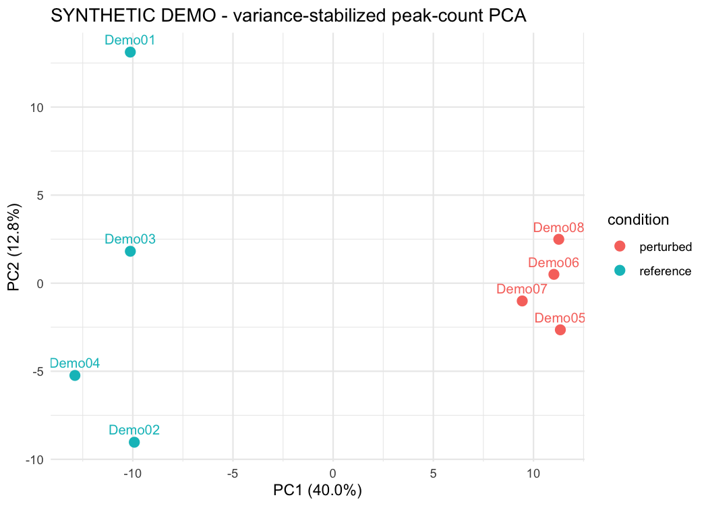
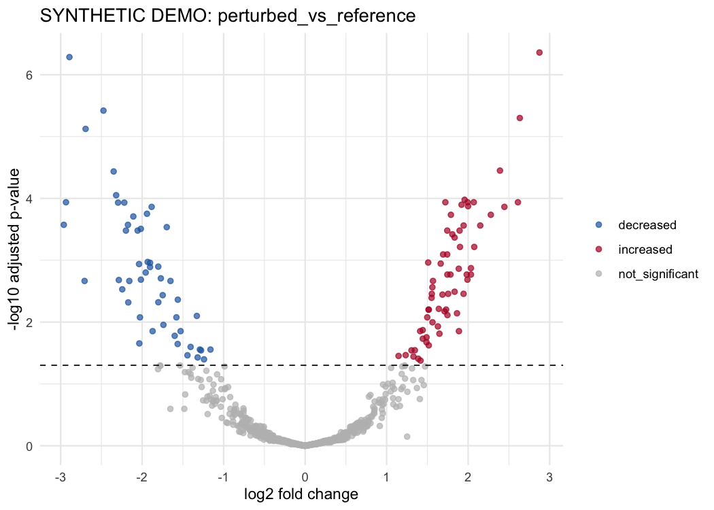

# CUT&RUN downstream analysis in R

A compact, parameterized workflow for downstream analysis of CUT&RUN consensus-peak counts. It accepts an explicit peak-by-sample integer count matrix, sample metadata, an additive categorical design, and declared contrasts. It produces sample QC, a DESeq2 differential-peak analysis, normalized counts, figures, result tables, and an HTML report.

This workflow model was developed during my postdoctoral research at Van Andel Institute. This repository is a reusable packaging of ideas from my original VAI analysis code; it is not the original study analysis, and its synthetic demonstration is not a VAI result.

## Synthetic demonstration



*Synthetic demonstration only. The deterministic negative-binomial fixture contains planted condition-level peak-count differences and has no biological interpretation.*



*Synthetic demonstration only. Differential-peak calls test workflow mechanics, not a biological hypothesis.*

## Requirements

- R
- Pandoc
- CRAN: `rmarkdown`, `knitr`, `ggplot2`
- Bioconductor: `DESeq2`, `SummarizedExperiment`

Optional coordinate annotation is a functioning, guarded stage rather than a placeholder. For the source-supported human hg38 path it requires these official Bioconductor packages:

- `GenomicRanges`
- `IRanges`
- `GenomeInfoDb`
- `AnnotationDbi`
- `ChIPseeker`
- `TxDb.Hsapiens.UCSC.hg38.knownGene`
- `org.Hs.eg.db`

Annotation additionally requires real hg38 peak coordinates with UCSC-style sequence names compatible with the selected TxDb.

The reviewed local runtime used R 4.6.1, Bioconductor 3.23, Pandoc 3.12, `DESeq2` 1.52.0, `GenomicRanges` 1.64.0, `IRanges` 2.46.0, `GenomeInfoDb` 1.48.0, `AnnotationDbi` 1.74.0, `ChIPseeker` 1.48.0, `TxDb.Hsapiens.UCSC.hg38.knownGene` 3.22.0, and `org.Hs.eg.db` 3.23.1.

The workflow never installs packages at run time.

## Inputs

- `peak_counts.csv`: required columns `peak_id`, `seqnames`, `start`, and `end`, followed by non-negative integer sample columns. Peak IDs and coordinate intervals must be unique and coordinates must already describe a consensus peak set.
- `metadata.csv`: one row per sample, with `sample_id` plus categorical design variables.
- `contrasts.csv`: columns `label`, `factor`, `numerator`, and `denominator`.
- An R configuration file modeled on `config/example_config.R`, including explicit `genome_build` and `coordinate_system` fields.

Supported coordinate declarations are `one_based_closed` and `bed_zero_based_half_open`. BED starts are converted once to one-based closed coordinates (`start + 1`, unchanged end); all result and annotation tables use one-based closed coordinates. Other conventions fail rather than being guessed.

Validation covers blank or duplicate headers (case-insensitive), unique IDs and intervals, integer/nonnegative count semantics, declared coordinate validity and conversion, exact sample matching and safe reordering, additive categorical designs, full-rank model matrices, declared contrast levels, unequal numerator/denominator levels, and case-insensitive output-name collisions.

## Genomic annotation

When annotation is enabled, the workflow:

1. requires the annotation and peak `genome_build` declarations to match exactly;
2. loads the configured TxDb and verifies its own genome metadata against that build;
3. requires every peak seqname to exist in the TxDb;
4. builds `GRanges` from the internally one-based closed peak coordinates;
5. runs `ChIPseeker::annotatePeak` with the configured TxDb, OrgDb, and TSS window;
6. preserves and verifies every unique `peak_id`; and
7. adds annotation columns to each differential-peak table as well as `peak_annotation.csv`.

The implemented annotation path supports human hg38 and refuses genome-build mixing. Peak coordinates, the configured build, and the selected TxDb must agree before annotation runs.

The core synthetic fixture uses `genome_build = "synthetic_v1"` and `chrSynthetic`; annotation is intentionally disabled. Simply toggling annotation on fails because the configured hg38 annotation build does not match the synthetic peak build. The separate `synthetic_hg38_annotation` mechanics fixture uses public hg38 TxDb-derived intervals with synthetic counts; it contains no experimental observations and supports annotation-path testing without relabeling synthetic coordinates.

## Normalization choice

The default `deseq2_median_ratio` mode estimates relative abundance and assumes that most retained peaks do not shift together. This can be inappropriate when CUT&RUN has a genuine global occupancy change. Such a run must not be interpreted as proving global gain or loss.

If an upstream experimental strategy provides defensible spike-in or other external scaling factors, choose `provided_deseq2_size_factors` and supply a two-column `sample_id,deseq2_size_factor` CSV. The factor is explicitly a DESeq2 divisor: `normalized count = count / deseq2_size_factor`. A multiplicative spike-in scaling factor must be inverted before use and its provenance documented. The workflow validates positivity, sample identity, reordering, geometric-mean centering, and final assignment, but it cannot establish whether the upstream control or transformation is biologically valid.

## Run the synthetic example

From the repository root:

```sh
Rscript --vanilla tests/test_helpers.R
Rscript --vanilla tests/test_core_analysis.R
Rscript --vanilla tests/test_annotation.R
Rscript --vanilla run_analysis.R --check-dependencies
Rscript --vanilla run_analysis.R config/example_config.R
Rscript --vanilla run_analysis.R config/annotation_test_config.R
```

Regenerate the deterministic, overdispersed negative-binomial fixture with:

```sh
Rscript --vanilla example/synthetic/generate_fixture.R
Rscript --vanilla example/synthetic_hg38_annotation/generate_fixture.R
```

## Outputs

The configured output directory receives:

- `cutandrun_downstream.html`
- `tables/run_metadata.csv`
- `tables/normalized_peak_counts.csv`
- `tables/size_factors.csv`
- `tables/contrast_summary.csv`
- `tables/<contrast>_deseq2.csv`
- `tables/peak_annotation.csv` when annotation succeeds; the same annotation columns are joined to every contrast result
- `figures/library_qc.png`
- `figures/pca.png`
- `figures/sample_correlation.png`
- `figures/<contrast>_volcano.png`
- `figures/<contrast>_top_peaks_heatmap.png`

## Scope and provenance

The workflow begins with a consensus peak-by-sample count matrix. Upstream alignment, BAM processing, consensus-peak definition, spike-in factor derivation, and raw-read QC remain outside this repository.

The reusable implementation focuses on differential-peak summaries and transformed-count QC and heatmaps. It does not claim to implement DiffBind, time-course clustering, cross-mark integration, regulatory networks, or pathway enrichment. External size factors are accepted only when a defensible upstream experimental strategy has already produced them; the workflow validates and applies those factors but does not infer their biological provenance.

No license has been selected.
