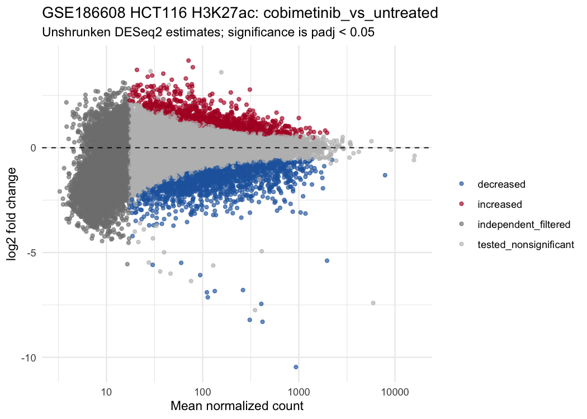
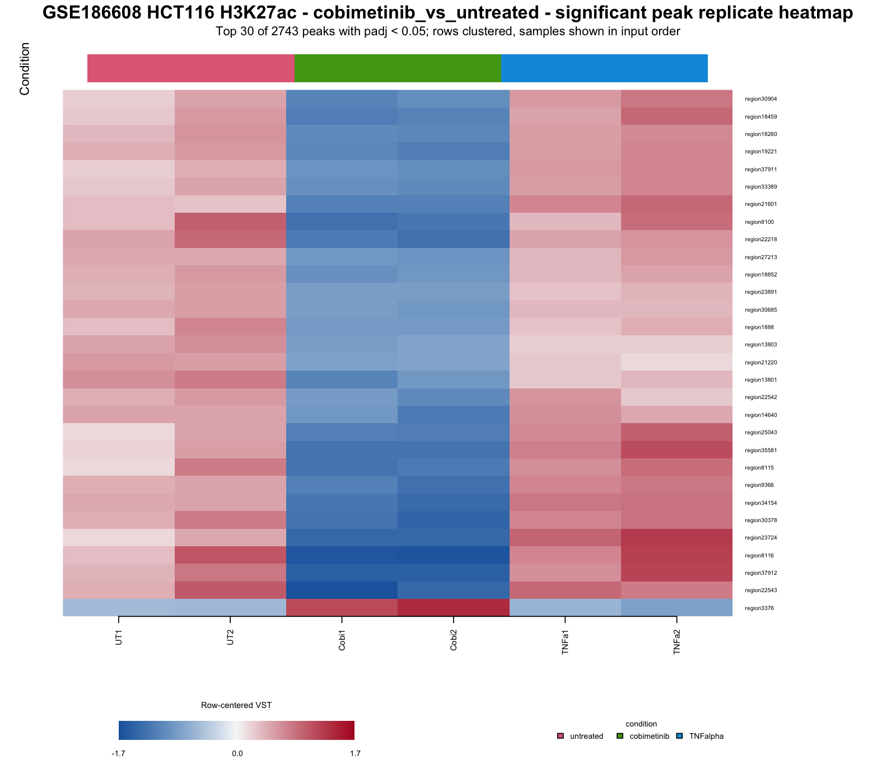

# CUT&RUN downstream analysis in R

An R workflow for quality control, DESeq2 differential peak analysis, hg38 annotation, replicate-level visualization, and a reviewable HTML report from a consensus peak-count matrix. The workflow pattern was developed during my postdoctoral work at Van Andel Institute; this repository packages it around an independent public-data example.

## Dataset and design

The main example uses H3K27ac CUT&RUN data from [GSE186608](https://www.ncbi.nlm.nih.gov/geo/query/acc.cgi?acc=GSE186608), reported by Ivancevic et al. (*Science Advances*, 2024). It contains HCT116 cells under three 24-hour conditions, with two biological replicates each: untreated, 1 uM cobimetinib, and 100 ng/mL TNFalpha.

- Comparisons: cobimetinib versus untreated; TNFalpha versus untreated
- Model: `~ condition`
- Input: aligned-read overlaps across the authors' union of per-sample top-20k peaks
- Genome/coordinates: hg38; source BED converted once from zero-based half-open to one-based closed
- Significance: Benjamini-Hochberg adjusted p-value < 0.05

No pairing or unreported batch term is added. The authors' resequenced/merged untreated replicate remains one biological sample.

## Run the public example

From the repository root:

```sh
Rscript --vanilla scripts/prepare_gse186608.R
Rscript --vanilla run_analysis.R config/gse186608_config.R
```

The preparation script downloads the two author-supplied source files, verifies their SHA-256 checksums and dimensions, and validates the exact BED/count-row mapping. The analysis writes complete tables and figures under `output/gse186608_h3k27ac/`.

Review the saved [HTML report](report/gse186608_h3k27ac_downstream.html), [contrast summary](results/gse186608/contrast_summary.csv), and [top significant-region snapshot](results/gse186608/top_significant_regions.csv). The workflow requires R, Pandoc, `rmarkdown`, `knitr`, `ggplot2`, `openssl`, `DESeq2`, `SummarizedExperiment`, and the hg38 Bioconductor annotation packages named in the configuration.

## Results

All 38,649 input regions are retained in exported tables; 31,730 nonzero regions receive a test statistic. At FDR 0.05:

- Cobimetinib versus untreated: 2,743 significant regions (1,084 increased; 1,659 decreased).
- TNFalpha versus untreated: 914 significant regions (802 increased; 112 decreased).



*Mean H3K27ac count versus unshrunken DESeq2 log2 fold change; colored points pass FDR 0.05.*



*Row-centered variance-stabilized counts for the 30 highest-ranked significant regions, with both replicates per condition shown.*

## Comparison with the published study

Ivancevic et al. report that MAPK/AP1 inhibition by cobimetinib preferentially decreases H3K27ac at responsive enhancers, whereas TNFalpha stimulation increases it, including at LTR10-derived enhancers. The aggregate significant-region counts are qualitatively consistent with the paper's treatment-specific H3K27ac results: losses outnumber gains after cobimetinib (1,659 versus 1,084), whereas gains outnumber losses after TNFalpha (802 versus 112). This does not test LTR10 enrichment or establish a global H3K27ac shift.

This comparison is directional, not a reproduction of the paper's LTR10 enrichment analysis or published peak counts. This workflow tests the supplied union peak matrix with DESeq2 and nearest-gene annotation; it does not classify repeats, model LTR10 enrichment, or repeat the authors' full pipeline and filtering.

## Scope and limitations

DESeq2 median-ratio normalization estimates relative signal and assumes that most tested regions do not share a common directional shift. Because these matrices have no reported spike-in or IgG/background scaling, the results cannot establish a global change in H3K27ac. Each condition has two biological replicates, and the untreated pair separates noticeably in sample-level QC. Raw-read, alignment, and BAM-level QC remain upstream.

## Citation

Ivancevic A et al. [Endogenous retroviruses mediate transcriptional rewiring in response to oncogenic signaling in colorectal cancer](https://doi.org/10.1126/sciadv.ado1218). *Science Advances*. 2024. Public data and author source files: [GSE186608](https://www.ncbi.nlm.nih.gov/geo/query/acc.cgi?acc=GSE186608), [Zenodo 10996183](https://zenodo.org/records/10996183), and pinned source tag `v1.0` / commit `faeef682bebdfb982c70b47a5d7df4ac77f61264`.

No repository license has been selected.
